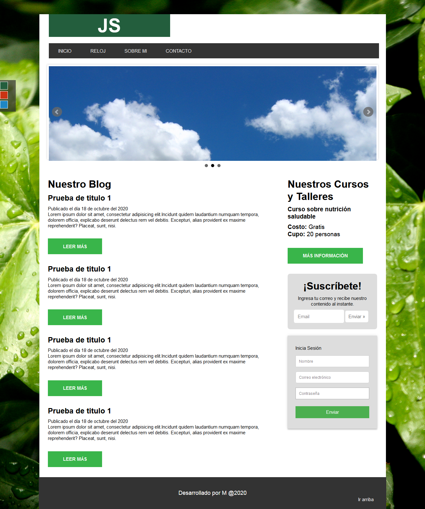

Blog HTML-CSS-JQuery 🚀
===========
📋 Práctica de un blog realizado con HTML, CSS y JQuery - JQuery UI.

## Realizado con 🛠️
* HTML
* CSS
* Jqeruy

## Autores ✒️
* **Michel Hdez** - (https://github.com/MichelHdez)